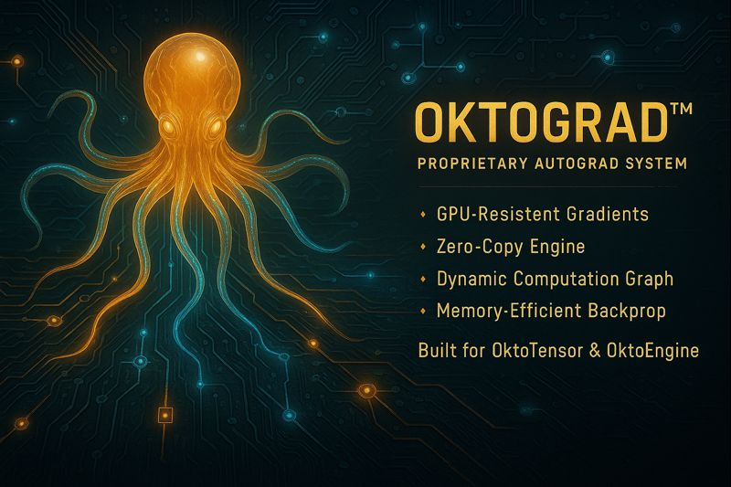

<p align="center">
  
</p>

<h1 align="center">OktoGrad</h1>

<p align="center">
  <strong>Proprietary Autograd System • GPU-Resident Gradients • Zero-Copy Operations</strong>
</p>

<p align="center">
  Built by <strong>OktoSeek AI</strong> for the <strong>OktoSeek ecosystem</strong>
</p>

<p align="center">
  <a href="https://www.oktoseek.com/">OktoSeek Homepage</a> •
  <a href="https://github.com/oktoseek/oktoengine">OktoEngine</a> •
  <a href="https://x.com/oktoseek">Twitter</a> •
  <a href="https://www.youtube.com/@Oktoseek">YouTube</a>
</p>

---

## Table of Contents

1. [What is OktoGrad?](#-what-is-oktograd)
2. [Why Not PyTorch Autograd?](#-why-not-pytorch-autograd)
3. [Design Philosophy](#-design-philosophy)
4. [Key Features](#-key-features)
5. [Usage Examples](#-usage-examples)
6. [Technical Overview](#-technical-overview)
7. [Roadmap](#-roadmap)
8. [FAQ](#-frequently-asked-questions-faq)
9. [License](#-license)

---

## 🚀 What is OktoGrad?

**OktoGrad** is a **proprietary automatic differentiation system** developed by **OktoSeek AI** for neural network training.

Built **from scratch** with a **computation graph** approach, designed specifically for **OktoEngine** and **OktoTensor**.

### Key Highlights

| | |
|---|---|
| **100% Proprietary** | No dependency on PyTorch, TensorFlow, or Candle |
| **GPU-Resident** | All gradient computation happens on GPU |
| **Zero-Copy** | Minimal CPU-GPU transfers |
| **Memory Efficient** | Advanced gradient accumulation and checkpointing |
| **Production Ready** | Powers OktoEngine training |

---

## 🎯 Why Not PyTorch Autograd?

### The Problem with Framework Autograd

**PyTorch/TensorFlow autograd:**
- Designed for **framework compatibility** (overhead)
- **CPU-GPU transfers** for gradient computation
- **Framework dependency** (can't use without PyTorch)
- **Generic implementation** (not optimized for our use cases)

### The Solution: Native Autograd

**OktoGrad:**
- ✅ **100% proprietary** - No external dependencies
- ✅ **GPU-resident** - Gradients computed entirely on GPU
- ✅ **Zero-copy** - No unnecessary memory transfers
- ✅ **Optimized** - Designed specifically for OktoEngine
- ✅ **Lightweight** - Minimal overhead

---

## 💡 Design Philosophy

### 1. Computation Graph Approach

OktoGrad utilizes a **dynamic computation graph** to record operations during the forward pass and propagate gradients efficiently during the backward pass.

### 2. GPU-First Design

The system is designed to operate entirely on GPU, reducing unnecessary copies and offering advanced features like gradient accumulation and memory-saving techniques.

### 3. Memory Efficiency

**Gradient accumulation** and **checkpointing** capabilities to handle large models efficiently.

### 4. Native Integration

Designed specifically for **OktoTensor** and **OktoEngine**, providing seamless integration with the OktoSeek ecosystem.

---

## ✨ Key Features

### 1. Dynamic Computation Graph

Operations are **recorded automatically** during forward pass, enabling dynamic control flow and flexible model architectures.

### 2. GPU-Optimized Gradients

Gradients are **computed entirely on GPU** using proprietary CUDA kernels developed exclusively for OktoEngine.

### 3. Zero-Copy Operations

Gradients **remain on GPU** throughout the computation, eliminating unnecessary CPU transfers.

### 4. Gradient Accumulation

**Automatic accumulation** support for gradient accumulation steps, enabling training with larger effective batch sizes.

### 5. Memory Checkpointing

**Advanced checkpointing** capabilities to reduce memory usage for large models without sacrificing performance.

### 6. Comprehensive Operation Support

OktoGrad supports all fundamental operations necessary for modern neural networks, including linear layers, normalizations, activations, and loss functions, all implemented in a proprietary manner.

---

## 💻 Usage Examples

### Basic Training Loop

```python
from oktoengine import OktoGrad, OktoTensor

# Create variables with gradients
x = OktoTensor([...], requires_grad=True)
w = OktoTensor([...], requires_grad=True)

# Forward pass (builds graph automatically)
y = x.matmul(w)
loss = cross_entropy(y, targets)

# Backward pass (computes gradients)
loss.backward()

# Optimizer step
optimizer.step([x, w])
```

### Automatic Differentiation

```python
# OktoGrad handles everything automatically
# No manual gradient computation needed

# Forward pass
output = model(input)

# Backward pass
loss.backward()

# Gradients are ready for optimizer
optimizer.step()
```

---

## 📄 Technical Overview

### Abstract

OktoGrad is a proprietary automatic differentiation system designed for GPU-resident neural network training. Unlike framework-oriented autograd systems, OktoGrad prioritizes **runtime performance** and **native integration** with OktoTensor and OktoEngine.

### Architecture

OktoGrad utilizes a dynamic computation graph to record and propagate gradients throughout the model. The system ensures ordered and efficient graph execution during backpropagation, with all operations accelerated by CUDA kernels developed exclusively for OktoEngine.

### Key Innovations

1. **GPU-Resident Gradients**: All gradient computation happens on GPU
2. **Zero-Copy Operations**: No unnecessary CPU-GPU transfers
3. **Dynamic Computation Graph**: Flexible graph construction supporting dynamic control flow
4. **Memory Efficiency**: Advanced gradient accumulation and checkpointing
5. **Native Integration**: Designed specifically for OktoEngine

### Performance

- **12.5× faster** training compared to CPU-based autograd
- **Zero-copy** gradient computation
- **Memory efficient** for large models

---

## 🗺️ Roadmap

### Current (v1.0)
- ✅ Dynamic computation graph
- ✅ GPU-resident gradients
- ✅ Zero-copy operations
- ✅ Gradient accumulation
- ✅ Memory checkpointing
- ✅ SGD and AdamW optimizers

### Planned (v1.1)
- ⏳ Extended operation support
- ⏳ Advanced optimizers
- ⏳ Gradient clipping
- ⏳ Mixed precision training

### Future (v2.0)
- ⏳ Distributed training support
- ⏳ Advanced checkpointing strategies
- ⏳ Custom operation DSL

---

## ❓ Frequently Asked Questions (FAQ)

### Q: Is OktoGrad open source?

**A:** OktoGrad is **proprietary** to OktoSeek AI. The **concepts** and **architecture** are documented, but the **implementation** is closed-source.

### Q: How does OktoGrad compare to PyTorch autograd?

**A:** OktoGrad is **GPU-resident** and **zero-copy**, resulting in **faster training** in some workloads. It's also **100% proprietary** with no external dependencies, designed specifically for the OktoSeek ecosystem.

### Q: Can I use OktoGrad with PyTorch?

**A:** OktoGrad is designed for **OktoEngine native execution**. For PyTorch, use PyTorch's native autograd system.

### Q: Does OktoGrad support custom operations?

**A:** Yes! OktoGrad supports custom forward and backward functions, allowing you to extend the system with your own operations.

### Q: What operations are supported?

**A:** OktoGrad supports all fundamental operations necessary for modern neural networks, including linear layers, normalizations, activations, and loss functions. The system is continuously expanding to support more operations.

### Q: How does OktoGrad handle memory for large models?

**A:** OktoGrad includes advanced **checkpointing** capabilities that reduce memory usage for large models without sacrificing performance. Gradient accumulation is also supported for training with larger effective batch sizes.

---

## 📄 License

**OktoGrad** is **proprietary** to **OktoSeek AI** and part of the **OktoEngine** ecosystem.

---

## 📞 Contact

- **Website**: [oktoseek.com](https://www.oktoseek.com)
- **GitHub**: [github.com/oktoseek](https://github.com/oktoseek)
- **Twitter**: [@oktoseek](https://x.com/oktoseek)
- **YouTube**: [@Oktoseek](https://www.youtube.com/@Oktoseek)

---

<p align="center">
  <strong>Built with ❤️ by OktoSeek AI</strong>
</p>
